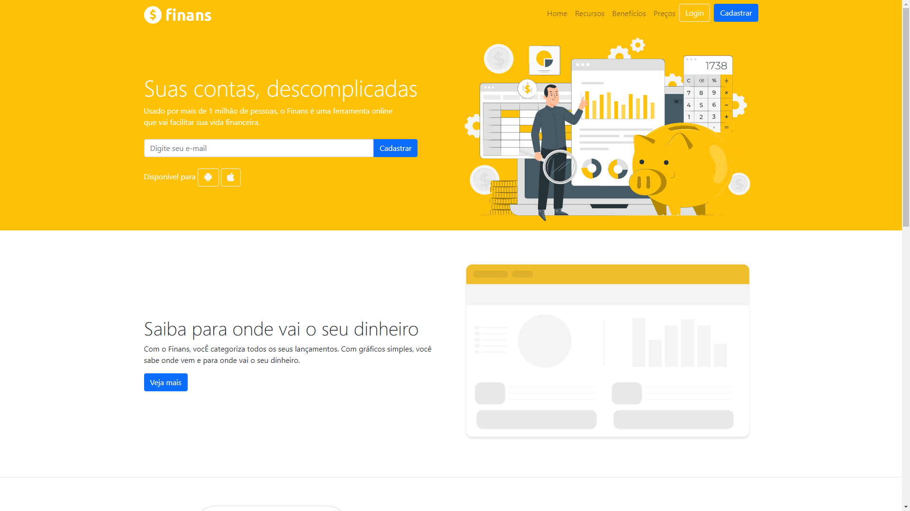
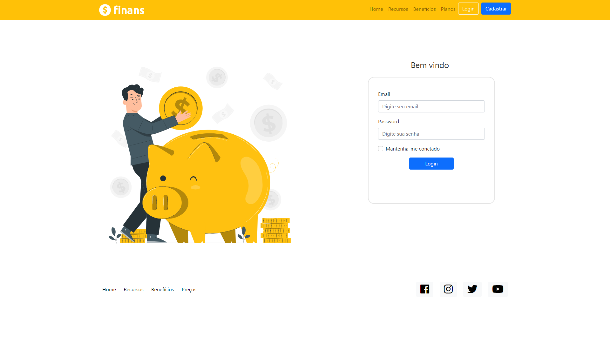
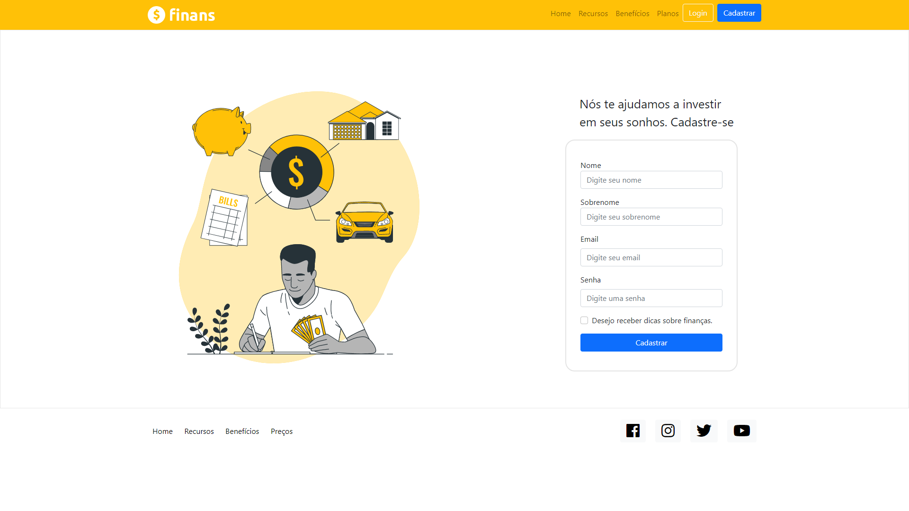
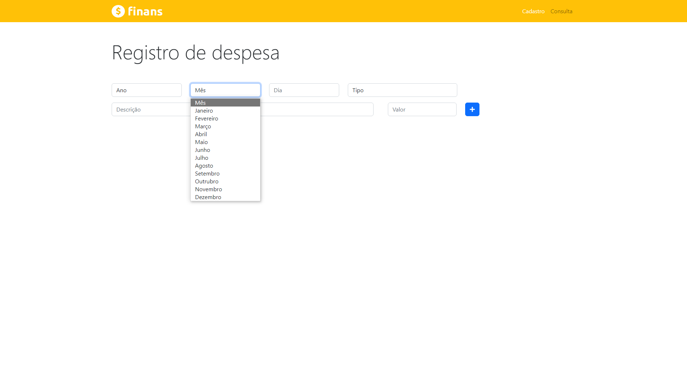
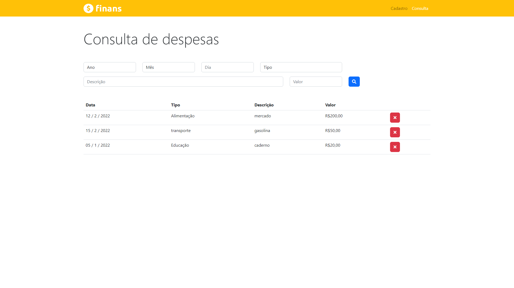

# Finans - plataforma de finanças pessoais.

A aplicação adiciona e armazena as despesas do usuário que onde são listas na tela de consulta. As despesas adicionadas são armazenas em localStorage.

---

